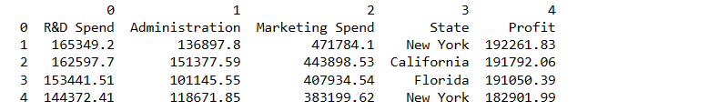
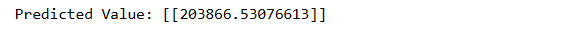

# EX 03: Implementation-of-Linear-Regression-Using-Gradient-Descent

## DATE:

## AIM:
To write a program to predict the profit of a city using the linear regression model with gradient descent.

## Equipments Required:
1. Hardware – PCs
2. Anaconda – Python 3.7 Installation / Jupyter notebook

## Algorithm
1. Load and preprocess data:

   * Load data using pandas.read_csv.
Separate features (X) and target variable (y).
Scale features and target variable using StandardScaler.
Define the linear_regression function:

    * Add a column of ones to X for the intercept term.
Initialize theta (model parameters) with zeros.
Perform gradient descent loop:

2. Inside the loop:
    * Calculate predictions using the dot product of X and theta.
    * Calculate errors as the difference between predictions and actual y values.
    * Update theta using the gradient descent formula with learning rate.
3. Learn model parameters:

    * Call the linear_regression function with scaled features and target variable.
    * This function returns the learned theta (model parameters).
4. Predict for new data point:

5. Create a new data point.
    * Scale the new data point using the fitted scaler.
6. Make prediction:

    * Calculate the prediction using the scaled new data point, appended with a 1 for the intercept, and the learned theta.
    * Inverse scale the prediction to get the original scale value.
7. Print the predicted value.


## Program:
```
/*
Program to implement the linear regression using gradient descent.
Developed by: VENKATANATHAN P R
RegisterNumber:  212223240173

import numpy as np
import pandas as pd
from sklearn.preprocessing import StandardScaler
def linear_regression(x1,y,learning_rate=0.01,num_iters=1000):
    
    # Add a column of ones to X for the intercept term
    
    X=np.c_[np.ones(len(x1)),x1]
    
    # Initialize theta with zeros
    
    theta = np.zeros(X.shape[1]).reshape(-1,1)

    # Perform gradient descent
    
    for _ in range(num_iters):
        
        # Calculate predictions
        
        predictions=(X).dot(theta).reshape(-1,1)
        
        # Calculate erros
        
        errors=(predictions-y).reshape(-1,1)
    
        # Update theta using gradient descent
        
        theta-=learning_rate*(1/len(x1))*X.T.dot(errors)

    return theta

data=pd.read_csv("50_Startups.csv",header=None)
print(data.head())
# Assuming the last column is your target variable 'y' and the preceding column

X=(data.iloc[1:,:-2].values)
# print(X)

x1=X.astype(float)
scaler=StandardScaler()
y=(data.iloc[1:,-1].values).reshape(-1,1)
# print(y)

x1_scaled=scaler.fit_transform(x1)
y1_scaled=scaler.fit_transform(y)
# print(x1_scaled)
# print(y1_scaled)

# Learn model parameters

theta=linear_regression(x1_scaled,y1_scaled)

# Predict target value for a new data point

new_data=np.array([165349.2,136897.8,471784.1]).reshape(-1,1)
new_scaled=scaler.fit_transform(new_data)
prediction=np.dot(np.append(1,new_scaled),theta)
prediction=prediction.reshape(-1,1)
pre=scaler.inverse_transform(prediction)
print(f"Predicted Value: {pre}")

```

## Output:





## Result:
Thus the program to implement the linear regression using gradient descent is written and verified using python programming.
